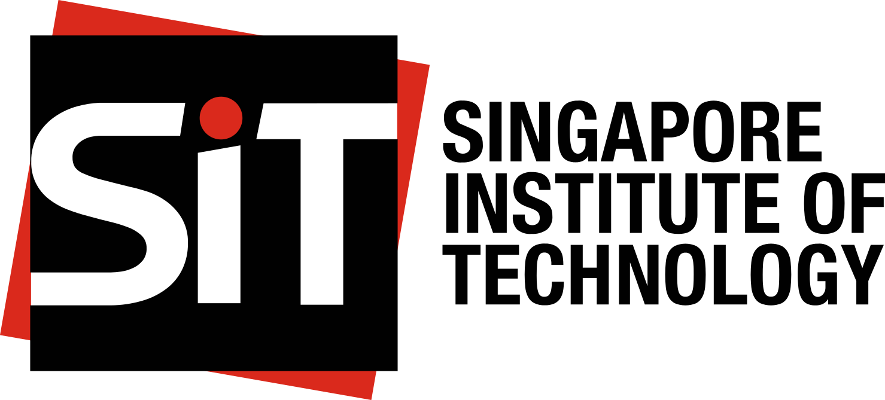
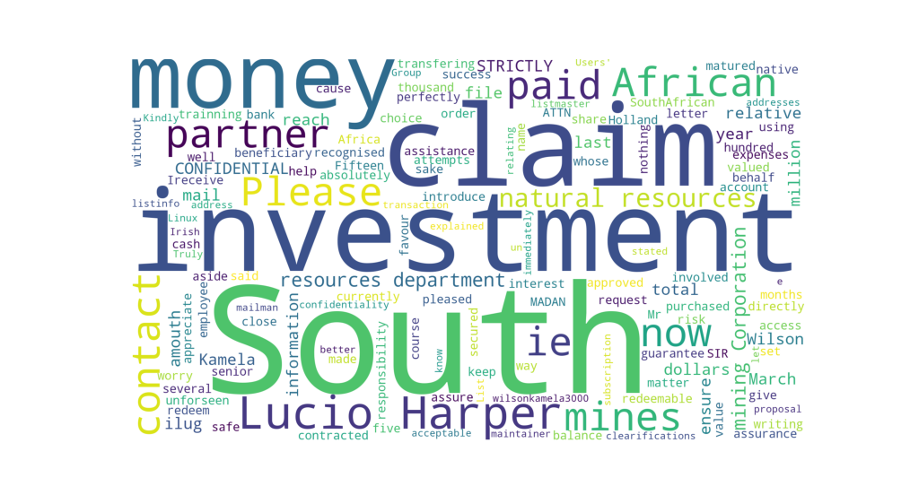

::: {.page-wrapper}

::: {.sit-info-box}

::: {.sit-logo}

:::

::: {.sit-text}
The Singapore Institute of Technology (SIT) is Singapore’s first University of Applied Learning and the third largest university by intake in Singapore. SIT’s mission is to maximise the potential of our learners and to innovate with industry, through an integrated applied learning and research approach, so as to contribute to the economy and society.
:::

:::


<h1>Header 01</h1>

This is text.

<h2>Header 02</h2>

::: {.two-col-section}

::: {.text-col}
Paragraphically, this is more text. Have a d6 dice roller in R.
:::

::: {.code-col}

```{r}
sample(1:6, size = 1)
```

:::

:::

<h3>A Previous Project</h3>

::: {.project-row}



<p>
The image above is a word cloud created using hundreds of actual scam emails.
It was used in a presentation for INF1002 Programming Fundamentals for a scam
detecting email reader.
</p>

:::

<h4>Video included for Educational Purposes</h4>



<p> Disclaimer: This is an educational website only. </p>

:::

